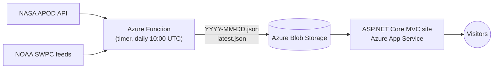

# Today in Space

A daily astronomy and space-weather digest. Each morning a scheduled Azure Function pulls NASA's Astronomy Picture of the Day and live space-weather data from NOAA's Space Weather Prediction Center, saves a snapshot, and an ASP.NET Core MVC site displays it — including an archive of every past day.

## Features

- **Astronomy Picture of the Day** with title, explanation, and credit
- **Space weather at a glance**: current Kp index, aurora chance, and solar wind speed, color-coded by severity
- **3-day Kp forecast** bar chart
- **Archive**: pick any past date to see that day's digest

## Architecture



- `src/TodayInSpace.Function` — .NET 8 isolated-worker Azure Function. Fetches APOD, current Kp, solar wind, and the Kp forecast, then writes a dated JSON digest plus `latest.json` to blob storage. Non-critical feeds degrade gracefully (the digest still publishes without them).
- `src/TodayInSpace.Web` — .NET 10 ASP.NET Core MVC site. Reads digests from blob storage; no database, no accounts.
- `tests/TodayInSpace.Web.Tests` — xUnit tests for the space-weather classification logic the views use.

Decoupling ingestion (Function) from display (web app) means the site never calls NASA or NOAA on a page load: pages stay fast, API rate limits don't matter, and every day's data is preserved for the archive.

## Running locally

Requirements: .NET 10 SDK (and .NET 8 SDK + Azure Functions Core Tools for the function).

```bash
# point the web app at a storage account (kept out of the repo via user-secrets)
cd src/TodayInSpace.Web
dotnet user-secrets set "Storage:ConnectionString" "<your storage connection string>"
dotnet run
```

For fully offline development you can use [Azurite](https://learn.microsoft.com/azure/storage/common/storage-use-azurite) with the connection string `UseDevelopmentStorage=true`.

The function reads `NASA_API_KEY`, `Storage__ConnectionString`, and `Storage__ContainerName` from environment variables / `local.settings.json` (git-ignored).

Run the tests:

```bash
dotnet test TodayInSpace.slnx
```

## Deploying

GitHub Actions (`.github/workflows/ci-cd.yml`) builds and tests every push and pull request. Pushes to `main` also deploy once these are configured in the repo settings:

| Type | Name | Value |
|---|---|---|
| Variable | `AZURE_WEBAPP_NAME` | App Service name |
| Secret | `AZURE_WEBAPP_PUBLISH_PROFILE` | Publish profile XML from the App Service |
| Variable | `AZURE_FUNCTIONAPP_NAME` | Function App name (optional) |
| Secret | `AZURE_FUNCTIONAPP_PUBLISH_PROFILE` | Publish profile XML from the Function App |

App settings in Azure: `Storage__ConnectionString` and `Storage__ContainerName` on both apps, plus `NASA_API_KEY` on the function.

## Background

Started as a team final project for CS 350 at South Puget Sound Community College (spring 2026). This repository is my continued version: the class-era email sign-up gate and the two-region client-side traffic split have been removed so the site is open to anyone and runs from a single region.

## Data sources

- [NASA APOD API](https://api.nasa.gov/)
- [NOAA Space Weather Prediction Center](https://www.swpc.noaa.gov/)
