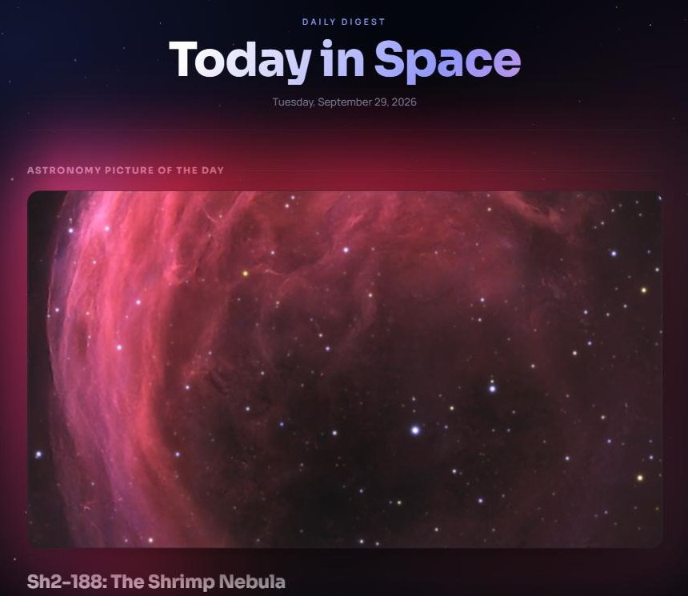
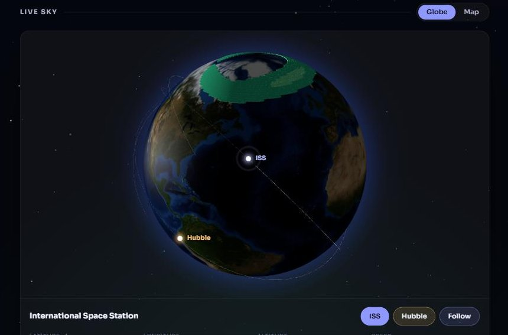

# Today in Space

### [Open the live site →](https://tis-app-east-hqdhdkh5eqfwh2ee.eastus-01.azurewebsites.net/)

A web app I built that shows NASA's Astronomy Picture of the Day, the chance of seeing the northern lights, and a 3D globe that tracks the International Space Station and the Hubble Space Telescope in real time.





## What you can do on the site

- See today's space photo from NASA
- Check the space weather and how likely the aurora is tonight
- Spin the globe and watch the ISS and Hubble move along their orbits (click one to follow it)
- Go back to any past day in the archive

## How it works

- An **Azure Function** runs every morning. It pulls the photo from NASA and the space weather from NOAA, then saves that day's data and a copy of the image to **Azure Blob Storage**.
- The website is **ASP.NET Core MVC (C#)**. It reads from storage instead of calling NASA on every page load, so it stays fast and every past day is kept.
- The globe works out where each satellite is right in the browser, using its latest orbit data (JavaScript with globe.gl and satellite.js).
- **GitHub Actions** builds the project, runs the tests, and deploys to Azure every time I push to `main`.

**Built with:** C#, .NET, ASP.NET Core MVC, Azure App Service, Azure Functions, Azure Blob Storage, JavaScript, xUnit, GitHub Actions

## Background

This started as my team's final project for CS 350 at SPSCC. Since then I've kept building on it on my own: I took out the sign-up wall so anyone can use it, moved it to one server, started saving the photos so the archive doesn't break when NASA changes links, and added the live globe.

## Running it yourself

You'll need the .NET 10 SDK (and Azure Functions Core Tools to run the function locally).

```bash
cd src/TodayInSpace.Web
dotnet user-secrets set "Storage:ConnectionString" "<your Azure Storage connection string>"
dotnet run
```

Run the tests with `dotnet test TodayInSpace.slnx`.

---

Data from [NASA APOD](https://api.nasa.gov/), [NOAA Space Weather Prediction Center](https://www.swpc.noaa.gov/), and [CelesTrak](https://celestrak.org/). Map tiles © OpenStreetMap contributors © CARTO. Earth imagery: NASA Blue Marble.
